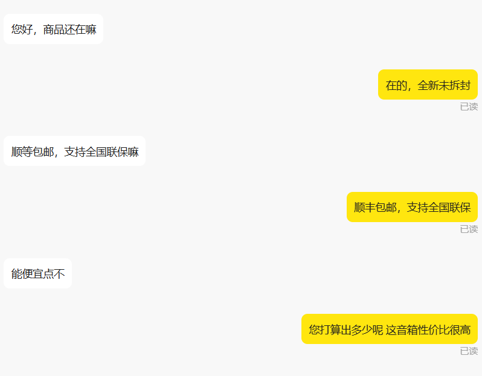

# agent-kefu-learning

`agent-kefu-learning` 是一个面向学习与拆解的公开仓库，用来展示“平台消息接入 + Prompt 路由 + 会话上下文 + 知识库模板”这一类 AI 客服项目的基本组织方式。

这个仓库保留了原项目的核心结构，并做了面向公开发布的二次整理：

- 默认关闭真实平台接入
- 删除真实业务数据、联系方式、支付码和群二维码
- 把 `货品资料/` 重构成模板化学习数据仓
- 把 `项目解析文档/` 重写成适合公开阅读的分析文档

## 项目定位

- 这是个人独立整理与二次开发后的学习项目，不是生产环境交付包
- 代码结构保留了真实接入路径，但公开版默认不联网、不索要 Cookie、不自动写入 `.env`
- 重点学习内容是：
  - 平台适配层如何组织
  - Agent / Prompt 如何分流
  - 会话上下文如何持久化
  - 商品知识库如何模板化

## 学习路径

先读这几个入口：

1. [项目解析文档/00_导读.md](./项目解析文档/00_导读.md)
2. [项目解析文档/01_项目总览.md](./项目解析文档/01_项目总览.md)
3. [项目解析文档/02_运行链路分析.md](./项目解析文档/02_运行链路分析.md)
4. [货品资料/README_学习版说明.md](./货品资料/README_学习版说明.md)

## 运行模式

### 默认学习模式

公开仓库默认使用：

```env
ENABLE_LIVE_PLATFORM=false
```

此时执行：

```powershell
python main.py
```

程序只会输出学习模式说明，不会：

- 校验真实 Cookie
- 连接 WebSocket
- 访问真实平台接口
- 交互式要求你粘贴密钥或 Cookie

### 本地自测模式

如果你要在自己的本地环境做合法自测：

1. 复制 `.env.example` 为 `.env`
2. 手动填入你自己的合法配置
3. 把 `ENABLE_LIVE_PLATFORM` 改为 `true`

```powershell
Copy-Item .env.example .env
```

公开版不会提供真实账号、真实 Cookie、真实 API，也不会指导如何抓取别人的凭据。

## 目录说明

```text
agent-kefu-learning/
├── main.py
├── XianyuApis.py
├── XianyuAgent.py
├── context_manager.py
├── prompts/
├── images/
├── 90_客服知识库/
├── 货品资料/
├── 项目解析文档/
└── 验证文档/
```

## 保留的示例素材

仓库只保留了 3 张安全演示图：




## `货品资料` 怎么看

`货品资料/` 在公开版中不再代表真实商品资产，而是一个学习型模板目录：

- 保留目录结构
- 保留字段说明、脚本骨架、FAQ 模板、知识库模板
- 只保留匿名样例
- 删除真实货源、真实价格、真实库存、真实链接、真实售后边界

如果你想用自己的数据练习，可以基于这些模板自行替换。

## 许可证与来源说明

本仓库继续保留 GPL-3.0。

这是你个人整理和二次开发后的学习型公开仓库，但核心工程结构来源于对上游开源项目 `XianyuAutoAgent` 的学习、拆解与再组织。公开版不会冒充“从零完全原创”，并会继续保留 GPL 许可证及必要的致谢说明。

## 安全说明

- 不要把真实 `.env` 提交到仓库
- 不要在文档、Issue、截图中暴露 API Key 或 Cookie
- 不要把真实商品数据、订单数据、售后记录、群二维码重新放回公开仓库
- 如需本地自测，请仅使用你自己的合法账号与配置
