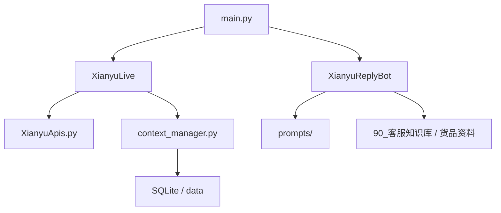
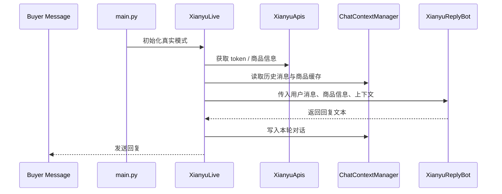
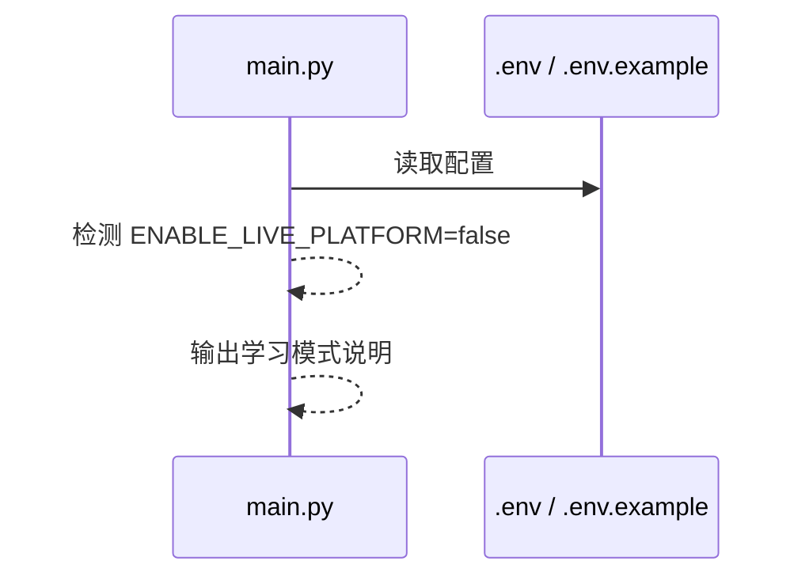

# 13 架构图与时序图

## 组件图

```mermaid
graph TD
    A["main.py"] --> B["XianyuLive"]
    A --> C["XianyuReplyBot"]
    B --> D["XianyuApis.py"]
    B --> E["context_manager.py"]
    C --> F["prompts/"]
    C --> G["90_客服知识库 / 货品资料"]
    E --> H["SQLite / data"]
```

## 真实模式时序图

```mermaid
sequenceDiagram
    participant User as Buyer Message
    participant Entry as main.py
    participant Live as XianyuLive
    participant API as XianyuApis
    participant Ctx as ChatContextManager
    participant Bot as XianyuReplyBot

    Entry->>Live: 初始化真实模式
    Live->>API: 获取 token / 商品信息
    Live->>Ctx: 读取历史消息与商品缓存
    Live->>Bot: 传入用户消息、商品信息、上下文
    Bot-->>Live: 返回回复文本
    Live->>Ctx: 写入本轮对话
    Live-->>User: 发送回复
```

## 学习模式时序图

```mermaid
sequenceDiagram
    participant Entry as main.py
    participant Env as .env / .env.example

    Entry->>Env: 读取配置
    Entry-->>Entry: 检测 ENABLE_LIVE_PLATFORM=false
    Entry-->>Entry: 输出学习模式说明
```
